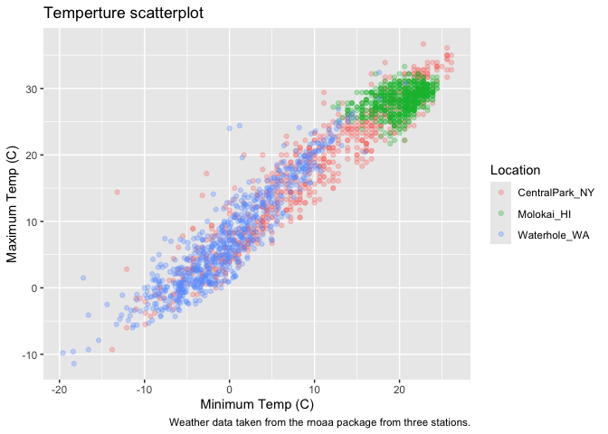
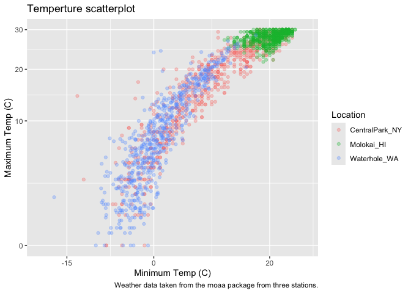
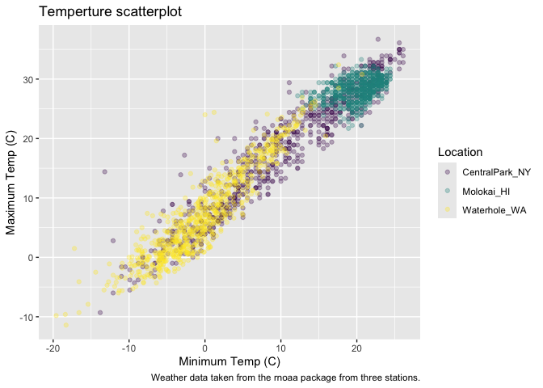

Vis_2
================
2024-10-01

Import the weather data.

``` r
weather_df = 
  rnoaa::meteo_pull_monitors(
    c("USW00094728", "USW00022534", "USS0023B17S"),
    var = c("PRCP", "TMIN", "TMAX"), 
    date_min = "2021-01-01",
    date_max = "2022-12-31") |>
  mutate(
    name = case_match(
      id, 
      "USW00094728" ~ "CentralPark_NY", 
      "USW00022534" ~ "Molokai_HI",
      "USS0023B17S" ~ "Waterhole_WA"),
    tmin = tmin / 10,
    tmax = tmax / 10) |>
  select(name, id, everything())
```

    ## using cached file: /Users/cindyho/Library/Caches/org.R-project.R/R/rnoaa/noaa_ghcnd/USW00094728.dly

    ## date created (size, mb): 2024-09-26 10:17:30.828386 (8.651)

    ## file min/max dates: 1869-01-01 / 2024-09-30

    ## using cached file: /Users/cindyho/Library/Caches/org.R-project.R/R/rnoaa/noaa_ghcnd/USW00022534.dly

    ## date created (size, mb): 2024-09-26 10:17:40.667428 (3.932)

    ## file min/max dates: 1949-10-01 / 2024-09-30

    ## using cached file: /Users/cindyho/Library/Caches/org.R-project.R/R/rnoaa/noaa_ghcnd/USS0023B17S.dly

    ## date created (size, mb): 2024-09-26 10:17:39.660442 (1.036)

    ## file min/max dates: 1999-09-01 / 2024-09-30

Making our first plot :-)

``` r
ggplot(weather_df, aes(x = tmin, y = tmax)) + 
  geom_point()
```

    ## Warning: Removed 17 rows containing missing values or values outside the scale range
    ## (`geom_point()`).

<!-- -->

``` r
weather_df |>
  ggplot(aes(x = tmin, y = tmax, color = name)) + 
  geom_point(alpha = .3) + 
  labs(
    title = "Temperture scatterplot", 
    x = "Minimum Temp (C)",
    y = "Maximum Temp (C)",
    color = "Location", 
    caption = "Weather data taken from the rnoaa package from three stations."
  )
```

    ## Warning: Removed 17 rows containing missing values or values outside the scale range
    ## (`geom_point()`).

<!-- -->

Scales == start with ‘x’ and ‘y’ and then do ‘color’.

``` r
weather_df |>
  ggplot(aes(x = tmin, y = tmax, color = name)) + 
  geom_point(alpha = .3) + 
  labs(
    title = "Temperture scatterplot", 
    x = "Minimum Temp (C)",
    y = "Maximum Temp (C)",
    color = "Location", 
    caption = "Weather data taken from the rnoaa package from three stations."
  ) + 
  scale_x_continuous(
    breaks = c(-15,0,20), 
    labels = c("-15", "0", "20") 
  ) + 
  scale_y_continuous(
    limits = c (0,30), 
    transform = "sqrt"
  )
```

    ## Warning in transformation$transform(x): NaNs produced

    ## Warning in scale_y_continuous(limits = c(0, 30), transform = "sqrt"): sqrt
    ## transformation introduced infinite values.

    ## Warning: Removed 302 rows containing missing values or values outside the scale range
    ## (`geom_point()`).

<!-- -->

Look at the color:

``` r
weather_df |>
  ggplot(aes(x = tmin, y = tmax, color = name)) + 
  geom_point(alpha = .3) + 
  labs(
    title = "Temperture scatterplot", 
    x = "Minimum Temp (C)",
    y = "Maximum Temp (C)",
    color = "Location", 
    caption = "Weather data taken from the rnoaa package from three stations."
  ) + 
  scale_color_hue(h = c(100,400)) + 
  viridis::scale_color_viridis(discrete = TRUE)
```

    ## Scale for colour is already present.
    ## Adding another scale for colour, which will replace the existing scale.

    ## Warning: Removed 17 rows containing missing values or values outside the scale range
    ## (`geom_point()`).

<!-- -->
